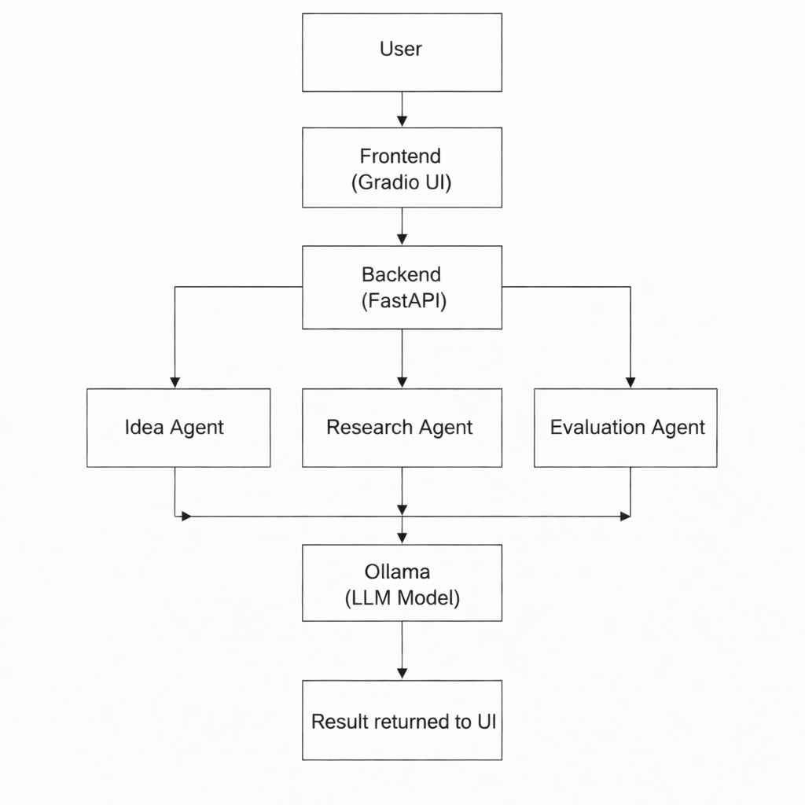

Agentic AI Flight Delay Risk Analyzer

An Agentic AI system that analyzes flight delay risks and recommends operational actions.
This project uses multiple AI agents, a local LLM via Ollama, and a Streamlit interface to demonstrate how AI agents collaborate to analyze operational conditions affecting flight departures.

#Problem Statement
Flight delays are a common issue in aviation operations.
Delays are caused by multiple factors such as:
Weather conditions
Airport congestion
Aircraft arrival delays
Airport operators must analyze multiple operational conditions quickly.
Current systems rely on manual monitoring or isolated tools.
There is a need for an AI-based system that can analyze delay risk and suggest mitigation strategies automatically.

#Project Overview

This project demonstrates how multiple AI agents collaborate to analyze flight delay risks.

The system takes flight number and departure airport as input and performs the following steps:

Planner Agent – Determines which operational factors should be analyzed.

Analysis Agent – Collects delay-related operational factors such as weather conditions, airport traffic, and aircraft arrival delays.

Decision Agent – Uses a local LLM (via Ollama) to evaluate the conditions and predict delay risk while recommending mitigation actions.

The output is a delay risk prediction along with reasoning and operational recommendations.

#Technologies Used

Python – Core programming language
Streamlit – Web interface for user interaction
LangGraph – Multi-agent workflow orchestration
Ollama – Run local LLMs
Phi-3 / Llama3 – Language model for decision reasoning
Agent-based architecture

#Project Folder Structure
flight_delay_ai/
│
├── agents.py
├── workflow_graph.py
├── app.py
├── requirements.txt
└── README.md

#File Description

agents.py
Contains all agents used in the system:

Planner Agent
Analysis Agent
Decision Agent

workflow_graph.py
Defines the agent workflow using LangGraph.
## Architecture Diagram

app.py
Streamlit interface that takes user input and displays results

#How to Run

1.Clone the repository
git clone https://github.com/your-username/flight-delay-agentic-ai.git
cd flight-delay-agentic-ai

2.Install dependencies

pip install streamlit langgraph langchain-ollama

3.Install and start Ollama

ollama serve

4.Download the LLM model

ollama pull phi3

or

ollama pull llama3

5.Run the project

streamlit run app.py

6.Open in browser

http://localhost:8501

Enter flight number and departure airport to analyze delay risk.

#sample output

Flight Number: AI202
Departure Airport: Delhi

Weather: Heavy rain detected
Traffic: Runway congestion high
Flight Status: Incoming aircraft delayed

Delay Risk: HIGH

Recommendation: Delay departure by 20 minutes or allocate an alternative runway.

#suggested improvements

-> Integrate real-time aviation and weather APIs.
-> Use historical flight datasets for better delay prediction.
-> Improve agent collaboration workflow for faster responses.
-> Enhance the Streamlit UI with visual analytics dashboards.
-> Deploy the system as a cloud-based application for airport operations.

#future scope

-> Integrate live flight tracking systems.
-> Apply machine learning models for predictive delay analytics.
-> Automate airport resource management such as gate allocation.
-> Expand the system to support airline fleet operations.

#main commands to include project in github

git init
git add .
git commit -m "Initial commit"
git remote add origin https://github.com/username/repository-name.git
git branch -M main
git push -u origin main

